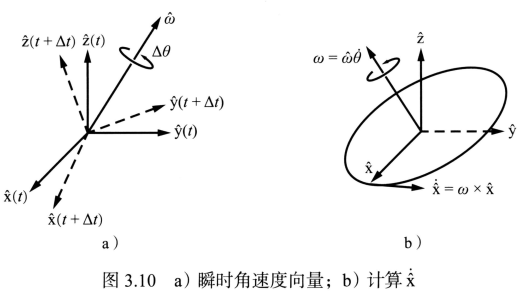
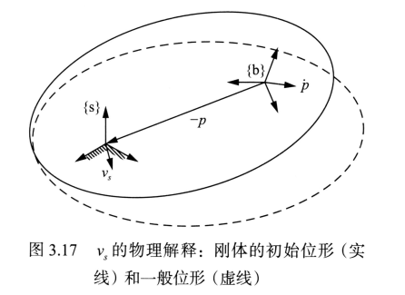

**旋转矩阵**

- **绕坐标系的坐标轴转动的公式：**

$$
\begin{array}{l}
Rot(\hat x,\theta ) = \left( {\begin{array}{*{20}{c}}
1&0&0\\
0&{\cos \theta }&{ - \sin \theta }\\
0&{\sin \theta }&{\cos \theta }
\end{array}} \right)\\
Rot(\hat y,\theta ) = \left( {\begin{array}{*{20}{c}}
{\cos \theta }&0&{\sin \theta }\\
0&1&0\\
{ - \sin \theta }&0&{\cos \theta }
\end{array}} \right)\\
Rot(\hat y,\theta ) = \left( {\begin{array}{*{20}{c}}
{\cos \theta }&{ - \sin \theta }&0\\
{\sin \theta }&{\cos \theta }&0\\
0&0&1
\end{array}} \right)
\end{array}
$$
角速度

假定坐标系${(\hat x,\hat y,\hat z)}$附着在一个旋转物体上。以${\hat x}$轴为例，定义${\hat x}$为单位长度。若物体旋转由时间$t$变化到$t+\Delta t$，物体坐标系的姿态相应的绕过原点的某一单位轴${\hat w}$旋转角度${\Delta{\theta}}$。轴${\hat w}$与参考坐标系选择无关。如果${\Delta t}$趋向于零。则$\Delta \theta /\Delta t$就表示**角速度**${{\dot \theta }}$,而${\hat w}$可以看做瞬时单位转动轴。则${{\dot \theta }}$和${\hat w}$组合在一起表示为**角速度**。即$\textcolor{green}{w = \hat w\dot \theta }$。

如下图：

则三个坐标轴的速度：
$$
{\dot{\hat x}} = w \times \hat x \\
\dot {\hat y} = w \times \hat y \\
\dot {\hat z} = w \times \hat z \\
$$
对于旋转矩阵$R(t)$的第一列$r_1(t)$表示固定坐标系的$\hat x$轴；类似第二列和第三列分表表示固定坐标系中的的$\hat y$轴和$\hat z$轴。则在固定坐标系中的表达式可以表示为：
$$
{{\dot r}_i} = {w_s} \times {r_i}
$$
$w_s$表示固定坐标系中角速度$w$。将上式转化为矩阵形式：
$$
\dot R = \left[ {\begin{array}{*{20}{c}}
{{w_s} \times {r_1}}&{{w_s} \times {r_2}}&{{w_s} \times {r_3}}
\end{array}} \right] = {w_s} \times R
$$
为将上式右边的叉积消去，引入新的运算，**反对称矩阵**：

​	**反对称矩阵定义如下**：

​		给定一个向量${x = [x_1{~~}x_2{~~}x_3]^T \in R^3}$，定义：
$$
[x] = \left[ {\begin{array}{*{20}{c}}
0&{ - {x_3}}&{{x_2}}\\
{{x_3}}&0&{ - {x_1}}\\
{ - {x_2}}&{{x_1}}&0
\end{array}} \right]
$$
​		矩阵$[x]$就是向量$x$对应的$3\times3$的反对称矩阵,且$[x] = -{x}^T$。

则$\textcolor{OrangeRed}{{\dot R} = {w_s \times R = [w_s]R}}$。${[w_s]}$为向量$w_s$的反对称矩阵。

​	对于给定的任意$w$总能满足：
$$
R[w]{R^T} = [Rw]
$$
由于$\textcolor{OrangeRed}{{\dot R} = {w_s \times R = [w_s]R}}$可以导出：
$$
\textcolor{OrangeRed}{[{w_s}] = \dot R{R^{ - 1}} ={\dot R}{R^T}}
$$
则$w_b$可以求出：
$$
\textcolor{OrangeRed}{{w_b} = {R_{sb}}^{ - 1}{w_s} = {R^{ - 1}}{w_s} = {R^T}{w_s}}
$$
${w_s}$为角速度$w$基于固定坐标系的向量表示形式，$[w_s]$是它的$3 \times 3$的矩阵形式；${w_b}$为角速度$w$基于物体坐标系的向量表示形式，${[w_b]}$是它的$3 \times 3$得矩阵表示形式。

**常见函数的泰勒级数展开（麦克劳林级数）：**
$$
\begin{array}{l}
{e^x} = 1 + x + \frac{{{x^2}}}{{2!}} + \frac{{{x^3}}}{{3!}} +  \cdots  = \sum\limits_{k = 0}^\infty  {\frac{{{x^k}}}{{k!}}} \\
\sin x = x - \frac{{{x^3}}}{{3!}} + \frac{{{x^5}}}{{5!}} -  \cdots  = \sum\limits_{n = 0}^\infty  {\frac{{{{( - 1)}^n}{x^{2n + 1}}}}{{(2n + 1)!}}} \\
\cos x = 1 - \frac{{{x^2}}}{{2!}} + \frac{{{x^4}}}{{4!}} -  \cdots  = \sum\limits_{n = 0}^\infty  {\frac{{{{( - 1)}^n}{x^{2n}}}}{{(2n)!}}} 
\end{array}
$$
**矩阵指数：**
$$
{e^{At}} = I + At + \frac{{{{(At)}^2}}}{{2!}} + \frac{{{{(At)}^3}}}{{3!}} +  \cdots
$$
矩阵指数满足如下特性：

1. $\textcolor{blue}{d({e^{At}})/dt = A{e^{At}} = {e^{At}}A}$
2. 若$A=PDP^{-1}(D \in R^{n*n},可逆矩阵P \in R^{n*n})$，则有$\textcolor{blue}{{e^{At}} = P{e^{Dt}}{P^{ - 1}}}$;
3. 若$AB=BA$,则有$\textcolor{blue}{{e^A}{e^B} = {e^{AB}}}$
4. $\textcolor{blue}{{({e^A})^{ - 1}} = {e^{ - A}}}$

- **罗德里格斯公式：**

$$
\textcolor{OrangeRed}{Rot(\hat w,\theta ) = {e^{[\hat w]\theta }} = I + \sin \theta \left[ {\hat w} \right] + \left( {1 - \cos \theta } \right){\left[ {\hat w} \right]^2}}
$$
**式子中$ {~}\theta{~}$采用弧度来表示**

刚体转动的矩阵对数：

${{\hat w}{\theta}}$表示旋转矩阵$R$的指数坐标，反对称矩阵$\left[ {\hat w\theta } \right] = \left[ {\hat w} \right]\theta$为矩阵的对数。

对罗德里格斯公式每个元素展开得到：
$$
\left( {\begin{array}{*{20}{c}}
{{c_\theta } + {{\hat w}_1}^2\left( {1 - {c_\theta }} \right)}&{{{\hat w}_1}{{\hat w}_2}\left( {1 - {c_\theta }} \right) - {{\hat w}_3}{s_\theta }}&{{{\hat w}_1}{{\hat w}_3}\left( {1 - {c_\theta }} \right) + {{\hat w}_2}{s_\theta }}\\
{{{\hat w}_1}{{\hat w}_2}\left( {1 - {c_\theta }} \right) + {{\hat w}_3}{s_\theta }}&{{c_\theta } + {{\hat w}_2}^2\left( {1 - {c_\theta }} \right)}&{{{\hat w}_2}{{\hat w}_3}\left( {1 - {c_\theta }} \right) - {{\hat w}_1}{s_\theta }}\\
{{{\hat w}_1}{{\hat w}_3}\left( {1 - {c_\theta }} \right) - {{\hat w}_2}{s_\theta }}&{{{\hat w}_2}{{\hat w}_3}\left( {1 - {c_\theta }} \right) + {{\hat w}_1}{s_\theta }}&{{c_\theta } + {{\hat w}_3}^2\left( {1 - {c_\theta }} \right)}
\end{array}} \right) = \left( {\begin{array}{*{20}{c}}
{{r_{11}}}&{{r_{12}}}&{{r_{13}}}\\
{{r_{21}}}&{{r_{22}}}&{{r_{23}}}\\
{{r_{31}}}&{{r_{32}}}&{{r_{33}}}
\end{array}} \right)
$$
其中$\hat w = \left( {\begin{array}{*{20}{c}}
{{{\hat w}_1}}&{{{\hat w}_2}}&{{{\hat w}_3}}
\end{array}} \right)$,${c_\theta } = \cos \theta $,${s_\theta } = \sin \theta $.

可以推导出；
$$
\begin{array}{l}
{r_{32}} - {r_{23}} = 2{{\hat w}_1}\sin \theta \\
{r_{13}} - {r_{31}} = 2{{\hat w}_2}\sin \theta \\
{r_{21}} - {r_{12}} = 2{{\hat w}_3}\sin \theta 
\end{array}
$$
当$\theta  \ne k\pi $时，也就是${sin {\theta}}\ne 0$时：
$$
\begin{array}{l}
{{\hat w}_1} = \frac{1}{{2\sin \theta }}\left( {{r_{32}} - {r_{23}}} \right)\\
{{\hat w}_2} = \frac{1}{{2\sin \theta }}\left( {{r_{13}} - {r_{31}}} \right)\\
{{\hat w}_3} = \frac{1}{{2\sin \theta }}\left( {{r_{21}} - {r_{12}}} \right)
\end{array}
$$
反对称矩阵$\left[ {\hat w} \right]$可以写成：
$$
\left[ {\hat w} \right] = \left[ {\begin{array}{*{20}{c}}
0&{ - {{\hat w}_3}}&{{{\hat w}_2}}\\
{{{\hat w}_3}}&0&{ - {{\hat w}_1}}\\
{ - {{\hat w}_2}}&{{{\hat w}_3}}&0
\end{array}} \right] = \frac{1}{{2\sin \theta }}\left( {R - {R^{\rm{T}}}} \right)
$$
且对角线元素和（矩阵的迹）$trR = {r_{11}} + {r_{22}} + {r_{33}} = 1 + 2\cos \theta $。

当$\theta = k\pi$时：

1. $k$为偶数时，无论${\hat w}$取何值，都会转回原处。即$R = I$，${\hat w}$不确定；

2. $k$为奇数时，罗德里格斯公式可以简化为：$R = {e^{\left[ {\hat w} \right]\pi }} = I + 2{\left[ {\hat w} \right]^2}$,
   $$
   {{\hat w}_{\rm{i}}} =  \pm \sqrt {\frac{{{r_{ii}} + 1}}{2}} ,i = 1,2,3
   $$
   可以导出：
   $$
   \begin{array}{l}
   2{{\hat w}_1}{{\hat w}_2} = {r_{12}}\\
   2{{\hat w}_2}{{\hat w}_3} = {r_{23}}\\
   2{{\hat w}_1}{{\hat w}_3} = {r_{13}}
   \end{array}
   $$
   

在$\theta  \in [0,\pi ]$中时：

1. 若$R = I$，${\hat w}$不确定；
2. 若$trR =-1$,则：${\theta} ={\pi} $,这时${\hat w} $可以去以下三种情况的任一值：（**$ - \hat w$也为一组解**）

$$
\begin{array}{l}
\hat w = \frac{1}{{\sqrt {2(1 + {r_{33}})} }}\left[ {\begin{array}{*{20}{c}}
{{r_{13}}}\\
{{r_{23}}}\\
{1 + {r_{33}}}
\end{array}} \right]\\
或\\
\hat w = \frac{1}{{\sqrt {2(1 + {r_{22}})} }}\left[ {\begin{array}{*{20}{c}}
{{r_{12}}}\\
{1 + {r_{22}}}\\
{{r_{32}}}
\end{array}} \right]\\
或\\
\hat w = \frac{1}{{\sqrt {2(1 + {r_{11}})} }}\left[ {\begin{array}{*{20}{c}}
{1 + {r_{11}}}\\
{{r_{21}}}\\
{{r_{31}}}
\end{array}} \right]
\end{array}
$$

3. 其他情况：
   $$
   \begin{array}{*{20}{l}}
   {\theta  = {{\cos }^{ - 1}}\left( {\frac{1}{2}\left( {trR - 1} \right)} \right) \in (0,\pi )}\\
   {\left[ {\hat w} \right] = \frac{1}{{2\sin \theta }}\left( {R - {R^{\rm{T}}}} \right)}
   \end{array}
   $$
   

**齐次变换矩阵**

若同时考虑刚体的位置和姿态。用旋转矩阵$R \in SO(3)$表示物体坐标系$\{b\}$相对固定坐标系${\{s\}}$的姿态；用向量$p \in R^3$表示$\{b\}$相对于${\{s\}}$的坐标。将二者集成到一个矩阵中，即为一个**特殊的欧式群**，也被称为**刚体运动群**或**齐次变换矩阵**，是所有$4 \times 4$实矩阵$T$的集合可以写为：
$$
T = \left[ {\begin{array}{*{20}{c}}
R&p\\
0&1
\end{array}} \right] = \left[ {\begin{array}{*{20}{c}}
{{r_{11}}}&{{r_{12}}}&{{r_{13}}}&{{p_1}}\\
{{r_{21}}}&{{r_{22}}}&{{r_{23}}}&{{p_2}}\\
{{r_{31}}}&{{r_{32}}}&{{r_{33}}}&{{p_3}}\\
0&0&0&1
\end{array}} \right]
$$
**齐次变换矩阵的性质：**

1. 齐次变换矩阵的**逆矩阵**也是齐次变换矩阵。
   $$
   {T^{ - 1}} = {\left[ {\begin{array}{*{20}{c}}
   R&p\\
   0&1
   \end{array}} \right]^{ - 1}} = \left[ {\begin{array}{*{20}{c}}
   {{R^T}}&{ - {R^T}p}\\
   0&1
   \end{array}} \right]
   $$
   
2. 两个齐次变换矩阵的乘积也是齐次变换矩阵。

3. 其次变换矩阵的乘法满足**结合律**，一般**不满足交换律**。

**运动旋量**

​	用$\{b\}$和${\{s\}}$分别表示移动（物体）坐标系和固定（空间）坐标系。令：
$$
{T_{sb}}(t) = T(t) = \left[ {\begin{array}{*{20}{c}}
{R(t)}&{p(t)}\\
0&1
\end{array}} \right]
$$
表示$\{b\}$相对${\{s\}}$的位形。用$T$代替$T_{sb}$。

- **物体的运动旋量：**

$$
\begin{array}{l}
{T^{ - 1}}\dot T = \;\left( {\begin{array}{*{20}{c}}
{{R^T}}&{ - {R^T}p}\\
0&1
\end{array}} \right)\left( {\begin{array}{*{20}{c}}
{\dot R}&{\dot p}\\
0&0
\end{array}} \right) = \left( {\begin{array}{*{20}{c}}
{{R^{ - 1}}\dot R}&{{R^{ - 1}}\dot p}\\
0&0
\end{array}} \right)\\
 = \left( {\begin{array}{*{20}{c}}
{{R^T}\dot R}&{{R^T}\dot p}\\
0&0
\end{array}} \right)\\
\; = \left[ {\begin{array}{*{20}{c}}
{\left[ {{\omega _b}} \right]}&{{v_b}}\\
0&0
\end{array}} \right]
\end{array}
$$

${R^{ - 1}}\dot R = \left[ {{\omega _b}} \right]$是物体坐标系$\{b\}$下描述角速度的反对称矩阵形式；${\dot p}$是在固定坐标系${\{s\}}$下个描述物体的线速度，因此${R^{-1}}{\dot p}$是在物体坐标系$\{b\}$下描述物体的线速度。

将$w_b$与${v_b}$组合在一起，构成一个六维向量的形式，将其定义为**物体坐标系中的速度**：
$$
\textcolor{OrangeRed}{\begin{array}{l}
{V_b} = \;\left[ {\begin{array}{*{20}{c}}
{{\omega _b}}\\
{{v_b}}
\end{array}} \right] \in {{\cal R}^{\bf{6}}}\\
{T^{ - 1}}\dot T = [{V_b}] = \left[ {\begin{array}{*{20}{c}}
{\left[ {{\omega _b}} \right]}&{{v_b}}\\
0&0
\end{array}} \right]
\end{array}}
$$

- **空间运动旋量：**

$$
\begin{array}{l}
\dot T{T^{ - {\bf{1}}}} = \left( {\begin{array}{*{20}{c}}
{\dot R}&{\dot p}\\
0&0
\end{array}} \right)\left( {\begin{array}{*{20}{c}}
{{R^T}}&{ - {R^T}p}\\
0&1
\end{array}} \right) = \;\left( {\begin{array}{*{20}{c}}
{\dot R{R^T}}&{\dot p\; - \dot R{R^T}p}\\
{\bf{0}}&{\bf{0}}
\end{array}} \right)\\
 = \left[ {\begin{array}{*{20}{c}}
{\left[ {{\omega _s}} \right]}&{{v_s}}\\
0&0
\end{array}} \right]\;
\end{array}
$$

​	${{\dot R}{R}={w_s}}$是在固定坐标系下描述角速度的反对称矩阵形式；${{v_s}={{\dot p}-{{\dot R}{R^T}p}}}$并不是在固定坐标系下描述物体原点的线速度（应该是$\dot p$）。将$v_s$重新描述
$$
{v_s} = \dot p - \dot R{R^T}p = \dot p - [{w_s}]p = \dot p + {w_s} \times ( - p)
$$
​	其$v_s$的物理意义可以描述为：假想运动**刚体的尺寸足够大**，$v_s$可以看做**刚体物体上与固定坐标系原点相重合点**的瞬时速度，并非在固定坐标系中的度量。如下图所示：

​	将$w_s$与$v_s$组合在一起，构成六维向量，将其定义为**固定坐标系中的速度**，简称为空间运动旋量。
$$
\textcolor{OrangeRed}{\begin{array}{l}
{V_s} = \;\left[ {\begin{array}{*{20}{c}}
{{\omega _s}}\\
{{v_s}}
\end{array}} \right] \in {{\cal R}^{\bf{6}}}\\
\left[ {{V_s}} \right] = \;\left[ {\begin{array}{*{20}{c}}
{\left[ {{\omega _s}} \right]}&{{v_s}}\\
0&0
\end{array}} \right]\; = \;\dot T{T^{ - {\bf{1}}}}
\end{array}}
$$

- **伴随矩阵：**
  $$
  \textcolor{OrangeRed}{\begin{array}{l}
  \left[ {{V_b}} \right] = {T^{ - {\bf{1}}}}\dot T \Rightarrow T\left[ {{V_{\bf{b}}}} \right] = \dot T \\
   \Rightarrow [{V_b}]= {T^{ - {\bf{1}}}}[ {{V_s}}]T\\
  \left[ {{V_s}} \right] = \dot T{T^{ - 1}} \\
  \Rightarrow \left[ {{V_s}} \right] = T\left[ {{V_b}} \right]{T^{ - {\bf{1}}}}
  \end{array}}
  $$

  $$
  \begin{array}{l}
  \left[ {{V_s}} \right] = \;T\left[ {{V_b}} \right]{T^{ - {\bf{1}}}}\\
  \left[ {\begin{array}{*{20}{c}}
  {[{w_s}]}&{{v_s}}\\
  0&0
  \end{array}} \right] = \left[ {\begin{array}{*{20}{c}}
  R&p\\
  0&1
  \end{array}} \right]\left[ {\begin{array}{*{20}{c}}
  {[{w_b}]}&{{v_b}}\\
  0&1
  \end{array}} \right]\left[ {\begin{array}{*{20}{c}}
  {{R^T}}&{ - {R^T}p}\\
  0&1
  \end{array}} \right]\\
  \left[ {\begin{array}{*{20}{c}}
  {[{w_s}]}&{{v_s}}\\
  0&0
  \end{array}} \right] = \left[ {\begin{array}{*{20}{c}}
  {R[{w_b}]{R^T}}&{ - R[{w_b}]{R^T}p + R{v_b}}\\
  0&0
  \end{array}} \right]\\
  \left[ {\begin{array}{*{20}{c}}
  {[{w_s}]}&{{v_s}}\\
  0&0
  \end{array}} \right] = \left[ {\begin{array}{*{20}{c}}
  {\left[ {R{w_b}} \right]}&{\left[ {R{w_b}} \right]p + R{v_b}}\\
  0&0
  \end{array}} \right]\\
  \left\{ {\begin{array}{*{20}{c}}
  {[{w_s}] = \left[ {R{w_b}} \right] \Rightarrow {w_s} = R{w_b}}\\
  {{v_s} = \left[ {R{w_b}} \right]p + R{v_b} \Rightarrow {v_s} = \left[ p \right]R{w_b} + R{v_b}}
  \end{array}} \right.\\
  \left[ {\begin{array}{*{20}{c}}
  {{w_s}}\\
  {{v_s}}
  \end{array}} \right] = \left[ {\begin{array}{*{20}{c}}
  R&0\\
  {\left[ p \right]R}&R
  \end{array}} \right]\left[ {\begin{array}{*{20}{c}}
  {{w_b}}\\
  {{v_b}}
  \end{array}} \right]
  \end{array}
  $$

  将$A{d_T} = \left[ {\begin{array}{*{20}{c}}
  R&0\\
  {  \left[ p \right]R}&R
  \end{array}} \right]$定义为与$T$相关的**伴随变换矩阵**。

  ​		定义伴随变换矩阵：

  ​				对于给定的$T$,其伴随变换矩阵${[Ad_T]}$为：
  $$
  A{d_T} = \left[ {\begin{array}{*{20}{c}}
  R&0\\
  {  \left[ p \right]R}&R
  \end{array}} \right]
  $$
  ​		对于任一$V$,与$T$相关联的伴随映射为：
  $$
  V' = [A{d_T}]V
  $$
  ​		或者写为：
  $$
  V' = A{d_T}(V)
  $$
  ​		也可以写成矩阵形式：
  $$
  [V'] = T[V]{T^{ - 1}}
  $$

​			伴随映射的特性：
$$
\begin{array}{l}
A{d_{{T_1}}}(A{d_{{T_2}}}(V)) = A{d_{{T_1}{T_2}}}(V)\\
[A{d_{{T_1}}}]\left[ {A{d_{{T_2}}}} \right]V = \left[ {A{d_{{T_1}{T_2}}}} \right]V\\
{[A{d_T}]^{ - 1}} = [A{d_{{T^{ - 1}}}}]
\end{array}
$$

- **运动旋量$V_s$与$V_b$之间的关系：**

$$
\textcolor{OrangeRed}{\begin{array}{l}
{T_{sb}} = \left[ {\begin{array}{*{20}{c}}
R&p\\
0&1
\end{array}} \right]\\
{V_s} = \left[ {\begin{array}{*{20}{c}}
{{w_s}}\\
{{v_s}}
\end{array}} \right] = \left[ {\begin{array}{*{20}{c}}
R&0\\
{\left[ p \right]R}&R
\end{array}} \right]\left[ {\begin{array}{*{20}{c}}
{{w_b}}\\
{{v_b}}
\end{array}} \right] = [A{d_{{T_{sb}}}}]{V_b}\\
{V_b} = \left[ {\begin{array}{*{20}{c}}
{{w_b}}\\
{{v_b}}
\end{array}} \right] = \left[ {\begin{array}{*{20}{c}}
{{R^T}}&0\\
{ - {R^T}\left[ p \right]}&{{R^T}}
\end{array}} \right]\left[ {\begin{array}{*{20}{c}}
{{w_s}}\\
{{v_s}}
\end{array}} \right] = [A{d_{{T_{bs}}}}]{V_s}
\end{array}}
$$

**刚体运动的指数表达: **

- **刚体运动的指数坐标: **

  推导矩阵指数$e^{[S]\theta}$的闭环形式：
  $$
  \begin{array}{l}
  {e^{[S]\theta }} = I + [S]\theta  + [S]\frac{{{\theta ^2}}}{{2!}} + {[S]^2}\frac{{{\theta ^3}}}{{3!}} +  \ldots  = \left[ {\begin{array}{*{20}{c}}
  {{e^{[w]\theta }}}&{G(\theta )v}\\
  0&1
  \end{array}} \right]\\
  G(\theta ) = I\theta  + [w]\frac{{{\theta ^2}}}{{2!}} + {[w]^2}\frac{{{\theta ^3}}}{{3!}} +  \ldots \\
   = I\theta  + \left( {\frac{{{\theta ^2}}}{{2!}} - \frac{{{\theta ^4}}}{{4!}} + \frac{{{\theta ^6}}}{{6!}} -  \cdots } \right)[w] + \left( {\frac{{{\theta ^3}}}{{3!}} - \frac{{{\theta ^5}}}{{5!}} + \frac{{{\theta ^7}}}{{7!}} -  \cdots } \right){[w]^2}\\
   = I\theta  + (1 - \cos \theta )[w] + (\theta  - \sin \theta ){[w]^2}
  \end{array}
  $$
  上式中化简利用公式：$[w]^3=-[w]$

  令$S=(w,v)$为螺旋轴，若$\parallel w\parallel =1 $，则对于任意的螺旋轴的距离$\theta \in R$，都有：

$$
\textcolor{OrangeRed}{{e^{[S]\theta }} = \left[ {\begin{array}{*{20}{c}}
{{e^{[w]\theta }}}&{(I\theta  + (1 - \cos \theta )[w] + (\theta  - \sin \theta ){{[w]}^2})v}\\
0&1
\end{array}} \right]}
$$

若$w = 0,\parallel v\parallel =1$，则：
$$
{e^{[S]\theta }} = \left[ {\begin{array}{*{20}{c}}
I&{v\theta }\\
0&1
\end{array}} \right]
$$
刚体运动的矩阵对数：
$$
[S]\theta  = \left[ {\begin{array}{*{20}{c}}
{[w]\theta }&{v\theta }\\
0&0
\end{array}} \right]
$$
若$R=I$，则$w =0,v=p/{\parallel p\parallel},且 {\theta}={\parallel p\parallel}$;

否则：
$$
\textcolor{OrangeRed}{\begin{array}{l}
v = {G^{ - 1}}(\theta )p\\
{G^{ - 1}}(\theta ) = \frac{1}{\theta }I - \frac{1}{2}[w] + \left( {\frac{1}{\theta } - \frac{1}{2}\cot \frac{\theta }{2}} \right){[w]^2}
\end{array}}
$$
**力旋量 **

​		作用在刚体上一点$r$的纯力$f$，定义参考坐标系${\{a\}}$，点$r$可以表示为$r_a$,力$f$可以表示为$f_a$。该力产生的**力矩**或**力偶**$m_a$可写为：$\textcolor{OrangeRed}{{m_a}={r_a} {\times} {f_a}}$(未考虑沿作用线的施力点)

将力矩和力合成为一个六维的**空间力**，称为**力旋量**，在${\{a\}}$系中描述为：
$$
{F_a} = \left[ {\begin{array}{*{20}{c}}
{{m_a}}\\
{{f_a}}
\end{array}} \right]
$$
​		如果刚体作用上的力旋量不止一个，那么将这些力旋量进行简单的向量叠加即可，只要在同一坐标系下进行即可。无力元素的力旋量称为**纯力偶**。

​		${\{a\}}$系中的力旋量也可以变换到其他坐标系中，前提${T_{ba}}$已知。建立$F_a$和$F_b$之间的映射关系方法之一是：

​				利用关于同一运动旋量的两种表达${V_a}$和${V_b}$；利用选取坐标系遵循同一系统功率相等的原则。力与速度的电机即为功率，功率为与坐标系无关的量，因此有：
$$
\begin{array}{l}
{V_b}^T{F_b} = {V_a}^T{F_a}\\
{V_b}^T{F_b} = {(Ad{T_{ab}}{V_b})^T}{F_a} = {V_b}^T{[Ad{T_{ab}}]^T}{F_a}
\end{array}
$$
​		因此有：
$$
\textcolor{OrangeRed}{\begin{array}{l}
{F_b} = {[Ad{T_{ab}}]^T}{F_a}\\
{F_a} = {[Ad{T_{ba}}]^T}{F_b}
\end{array}}
$$
**雅克比矩阵推导过程: **

- **空间坐标系下的雅克比矩阵推导过程: **

考虑一个***n***的开链机器人,其正向运动学的指数级公式为：

空间速度$$\pmb{{\cal V}_s}$$可以写成$$\left[ {\pmb{{\cal V}_s}} \right] = {\pmb{\dot T}}{\pmb{T^{ - 1}}}$$，其中
$$
\begin{array}{l}
{\pmb{\dot T}} = \left( {\frac{d}{{dt}}{e^{[\pmb{S_1}]{\theta _1}}}} \right) \cdots {e^{[\pmb{S_n}]{\theta _n}}}M + {e^{[\pmb{S_1}]{\theta _1}}}\left( {\frac{d}{{dt}}{e^{[\pmb{S_2}]{\theta _2}}}} \right) \cdots {e^{[\pmb{S_n}]{\theta _n}}}M +  \cdots   \\
 {\rm{}} = \left[ {\pmb{S_1}} \right]{{\dot \theta }_1}{e^{[\pmb{S_1}]{\theta _1}}} \cdots {e^{[\pmb{S_n}]{\theta _n}}}M + {e^{[\pmb{S_1}]{\theta _1}}}\left[{\pmb{S_2}} \right]{{\dot \theta}_2}{e^{[\pmb{S_2}]{\theta _2}}} \cdots {e^{[\pmb{S_n}]{\theta _n}}}{\pmb{M}} +  \cdots 
\end{array}
$$
对于：${\pmb{T^{ - 1}}} = {\pmb{M^{ - 1}}}{e^{ - [\pmb{S_n}]{\theta _n}}} \cdots {e^{ - [\pmb{S_1}]{\theta _1}}}$

则计算$\dot T{T^{ - 1}}$可以得到：
$$
\begin{array}{l}
\dot T{T^{ - 1}} = \left( {\left[ {{S_1}} \right]{{\dot \theta }_1}{e^{[{S_1}]{\theta _1}}} \cdots {e^{[{S_n}]{\theta _n}}}M + {e^{[{S_1}]{\theta _1}}}\left[ {{S_2}} \right]{{\dot \theta }_2}{e^{[{S_2}]{\theta _2}}} \cdots {e^{[{S_n}]{\theta _n}}}M +  \cdots } \right){M^{ - 1}}{e^{ - [{S_n}]{\theta _n}}} \cdots {e^{ - [{S_1}]{\theta _1}}}\\
{{~~~~~~~~~~~}{= }}\left[ {{S_1}} \right]{{\dot \theta }_1}{e^{[{S_1}]{\theta _1}}} \cdots M{M^{ - 1}}{e^{ - [{S_n}]{\theta _n}}} \cdots {e^{ - [{S_1}]{\theta _1}}} + {e^{[{S_1}]{\theta _1}}}\left[ {{S_2}} \right]{{\dot \theta }_2}{e^{[{S_2}]{\theta _2}}} \cdots {e^{[{S_n}]{\theta _n}}}M{M^{ - 1}}{e^{ - [{S_n}]{\theta _n}}} \cdots {e^{ - [{S_1}]{\theta _1}}}\\
{\rm{          }} +  \cdots  + {e^{[{S_1}]{\theta _1}}} \cdots {e^{[{S_{{\rm{n - }}1}}]{\theta _{{\rm{n - }}1}}}}\left[ {{S_{\rm{n}}}} \right]{{\dot \theta }_n}{e^{[{S_n}]{\theta _n}}}M{M^{ - 1}}{e^{ - [{S_n}]{\theta _n}}} \cdots {e^{ - [{S_1}]{\theta _1}}}\\
\left[ {{{\cal V}_s}} \right]{\rm{ = }}\left[ {{S_1}} \right]{{\dot \theta }_1} + {e^{[{S_1}]{\theta _1}}}\left[ {{S_2}} \right]{{\dot \theta }_2}{e^{ - [{S_1}]{\theta _1}}} +  \cdots  + {e^{[{S_1}]{\theta _1}}} \cdots {e^{[{S_{{\rm{n - }}1}}]{\theta _{{\rm{n - }}1}}}}\left[ {{S_{\rm{n}}}} \right]{{\dot \theta }_n}{e^{ - [{S_{{\rm{n - }}1}}]{\theta _{{\rm{n - }}1}}}} \cdots {e^{ - [{S_1}]{\theta _1}}}
\end{array}
$$
将:

$\left[ {{{\cal V}_s}} \right]{\rm{ = }}\left[ {{S_1}} \right]{{\dot \theta }_1} + {e^{[{S_1}]{\theta _1}}}\left[ {{S_2}} \right]{{\dot \theta }_2}{e^{ - [{S_1}]{\theta _1}}} +  \cdots  + {e^{[{S_1}]{\theta _1}}} \cdots {e^{[{S_{{\rm{n - }}1}}]{\theta _{{\rm{n - }}1}}}}\left[ {{S_{\rm{n}}}} \right]{{\dot \theta }_n}{e^{ - [{S_{{\rm{n - }}1}}]{\theta _{{\rm{n - }}1}}}} \cdots {e^{ - [{S_1}]{\theta _1}}}$

通过伴随矩阵写成向量形式，即：
$$
{{\cal V}_s} = {S_1}{{\dot \theta }_1} + {\rm{A}}{{\rm{d}}_{{e^{[{S_1}]{\theta _1}}}}}\left( {{S_2}} \right){{\dot \theta }_2} + {\rm{A}}{{\rm{d}}_{{e^{[{S_1}]{\theta _1}}}{e^{[{S_2}]{\theta _2}}}}}\left( {{S_3}} \right){{\dot \theta }_3} \cdots {\rm{A}}{{\rm{d}}_{{e^{[{S_1}]{\theta _1}}}{e^{[{S_2}]{\theta _2}}} \cdots {e^{[{S_{{\rm{n - 1}}}}]{\theta _{{\rm{n - 1}}}}}}}}\left( {{S_{\rm{n}}}} \right){{\dot \theta }_{\rm{n}}}
$$
令${{\cal V}_s}$可以写为几个空间向量的形式$J_{s1} = S_1{{\dot \theta}}_1$,$J_{s2} = A{d_{e^{[s_1]{\dot {\theta}_1}}}}(S_2){\dot {\theta}_2}$,$J_{s3} = A{ d_{ {e^{[s_1] {\dot {\theta}_1}}} { e^{ [s_2]{ \dot { \theta}_2}}}}}(S_3){ \dot { \theta}_3}$

则： 

​                                                    ${\pmb{{\cal V}_s} }= {\pmb{J_{s1}}}{{\dot \theta }_1} + {\pmb{J_{s2}}}(\theta ){{\dot \theta }_2} +  \cdots {\pmb{J_{sn}}}(\theta ){{\dot \theta }_n}$

式子中，${\pmb{J_{si}}}(\theta ) = \left( {\pmb{w_{si}}(\theta ),{\pmb{v_{si}}}(\theta )} \right)$是关节变量$\theta$的函数。其中$i = 2, \cdots,n$

化为矩阵形式：
$$
\begin{array}{l}
\pmb{{{\cal V}_s}} = \left[ {\begin{array}{*{20}{c}}
\pmb{{J_{S1}}}&{\pmb{J_{S2}}(\theta )}& \cdots &{\pmb{J_{sn}}(\theta )}
\end{array}} \right]\left[ {\begin{array}{*{20}{c}}
{{{\dot \theta }_1}}\\
{{{\dot \theta }_2}}\\
 \vdots \\
{{{\dot \theta }_n}}
\end{array}} \right]\\
{\pmb{{{\cal V}_s}}= \pmb{J_S}(\theta )\dot \theta}
\end{array}
$$

矩阵$\pmb{J_S}(\theta)$即为**空间固定坐标系**形式下的雅克比矩阵，简称__空间雅克比__。

**总结**：

***n***的开链机器人,其正向运动学的指数级公式为：
$$
{\textcolor{blue}{\pmb{T}({\theta_1}, \cdots {\theta _n}) = {e^{[\pmb{S_1}]{\theta _1}}}{e^{[\pmb{S_2}]{\theta _2}}}{e^{[\pmb{S_3}]{\theta _3}}} \cdots {e^{[\pmb{S_n}]{\theta _n}}}\pmb{M}}}
$$
空间雅克比$J_s(\theta)$通过：
$$
{\textcolor{blue}{\pmb{{{\cal V}_s}}= \pmb{J_S}(\theta ){\pmb{\dot \theta}}}}
$$
将关节速度向量${\dot \theta}$与空降速度${\pmb{\cal V_s}}$有机的联系在一起，${J_s{(\theta)}}$的第$i$列为：
$$
{\textcolor {blue}{{\pmb{J_{si}}}(\theta ) = A{d_{{e^{[\pmb{S_1}]{\theta _1}}}{e^{[\pmb{S_2}]{\theta _2}}} \cdots {e^{[\pmb{S_{{\rm{n - 1}}}}]{\theta _{{\rm{n - 1}}}}}}}}\left( {\pmb{S_{\rm{i}}}} \right){~~~} (i = 2,3, \cdots, n)}}
$$
**2. 物体坐标系下的雅克比矩阵推导过程: **

正向运动学的另一种指数级公式，即：
$$
{\pmb{T(\theta )}} = M{e^{\pmb[{{\cal B}_1}]{\theta _1}}}{e^{[{\pmb{\cal B}_2}]{\theta _2}}} \cdots {e^{[{\pmb{\cal B}_n}]{\theta _n}}}
$$
同时${\pmb{\dot T}}$和${\pmb T}$的表达式为：
$$
{\pmb{\dot T}} = {\pmb{M}}{e^{[{{\cal B}_1}]{\theta _1}}} \cdots {e^{[{{\cal B}_n}]{\theta _n}}}[{{\cal B}_n}]{{\dot \theta }_{\cal{n}}} + {\pmb{M}}{e^{[{{\cal B}_1}]{\theta _1}}} \cdots {e^{[{{\cal B}_{n - 1}}]{\theta _{n - 1}}}}[{{\cal B}_{n - 1}}]{e^{[{{\cal B}_n}]{\theta _n}}}{{\dot \theta }_{n - 1}} +  \cdots {\pmb{M}}{e^{[{{\cal B}_1}]{\theta _1}}}[{{\cal B}_1}]{e^{[{{\cal B}_2}]{\theta _2}}} \cdots {e^{[{{\cal B}_n}]{\theta _n}}}{{\dot \theta }_1}
\\
{{\pmb{T}}^{ - 1}} = {e^{ - [{{\pmb{\cal B}}_{\bf{n}}}]{{\pmb{\theta }}_n}}} \cdots {e^{ - [{\pmb{\cal{B}}_1}]{{\pmb{\theta }}_1}}}{{\pmb{M}}^{ - 1}}
$$
计算的${\dot T}{T^{-1}}$得：
$$
\left[ {{{\cal V}_b}} \right] = {T^{ - 1}}\dot T\\
{} = [{{\cal B}_n}]{{\dot \theta }_n} + {e^{ - [{{\cal B}_n}]{\theta _n}}}\left[ {{{\cal B}_{n - 1}}} \right]{e^{[{{\cal B}_n}]{\theta _n}}}{{\dot \theta }_{n - 1}} +  \cdots {e^{ - [{{\cal B}_n}]{\theta _n}}} \cdots {e^{ - [{{\cal B}_2}]{\theta _2}}}\left[ {{{\cal B}_1}} \right]{e^{[{{\cal B}_2}]{\theta _2}}} \cdots {e^{[{{\cal B}_n}]{\theta _n}}}{{\dot \theta }_1}
$$
以矩阵形式表达：
$$
{{\cal V}_b} = {{\cal B}_n}{{\dot \theta }_n} + A{d_{{e^{ - [{{\cal B}_n}]{\theta _n}}}}}({{\cal B}_{n - 1}}){{\dot \theta }_{n - 1}} +  \cdots A{d_{{e^{ - [{{\cal B}_n}]{\theta _n}}} \cdots {e^{ - [{{\cal B}_2}]{\theta _2}}}}}({{\cal B}_1}){{\dot \theta }_1}
$$
令${J_bn}={\cal B_n}$,${J_{b,n-1}}={Ad_{e^{-[{\cal B}]{\dot{\theta}_n}}}{\dot \theta}_{n-1}}$ ${J_{b1}}={Ad_{{e^{-[{\cal B_n}]{\dot{\theta}_n}}{\cdots}{e^{-[{\cal B_2}]{\dot{\theta}_2}}}}}{(\cal B_1)}{\dot \theta}_{n-1}}$，即可得：
$$
{{\cal V}_b} = {J_{b1}}(\theta ){{\dot \theta }_1} +  \cdots {J_{bn - 1}}(\theta ){{\dot \theta }_{n - 1}} + {J_{bn}}(\theta ){{\dot \theta }_n}
$$
写成矩阵形式：
$$
{{\cal V}_b} = \left[ {\begin{array}{*{20}{c}}
{{J_{b1}}(\theta )}& \cdots &{{J_{bn - 1}}}&{{J_{bn}}}
\end{array}} \right]\left[ {\begin{array}{*{20}{c}}
{{{\dot \theta }_1}}\\
 \vdots \\
{{{\dot \theta }_{n - 1}}}\\
{{{\dot \theta }_n}}
\end{array}} \right] = {J_b}(\theta )\dot \theta
$$
矩阵$\pmb{J_b}(\theta)$即为**末端（或物体）坐标**形式下的雅克比矩阵，简称__物体雅克比__。

